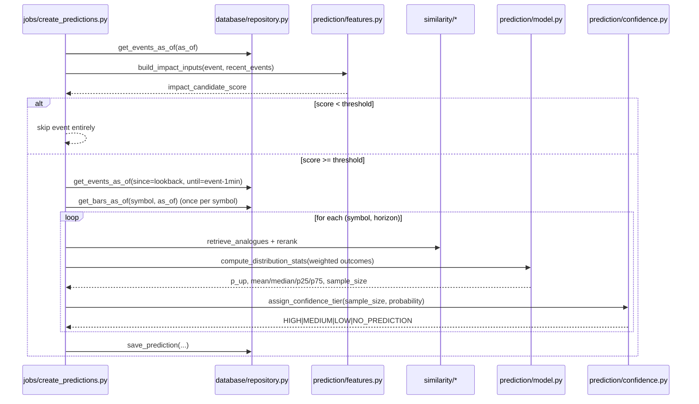

# WorldPulse -- High-Level Design

## 1. What this system does

WorldPulse watches a stream of real-world events (conflict, military
activity, energy disruption, economic/policy announcements, natural
disasters), turns each into a structured record, finds historically
similar past events, looks at what actually happened to a basket of
financial instruments after those past events, and uses that historical
analogue distribution to produce a **prediction** for the current event:
direction, probability, expected/median return, a confidence tier, and a
sample size -- for each relevant instrument and time horizon.

Predictions are immutable once created. A background resolver later fills
in what actually happened, and a scoring/calibration layer reports how
good the predictions really are, compared against simple baselines.

This document describes the system context, the reasoning for splitting
responsibilities the way we did, the data flow, and the non-goals of this
prototype. See `docs/LLD.md` for concrete schemas and algorithms, and
`docs/UI_SPEC.md` for the dashboard.

## 2. The four responsibilities, and why they're separated

WorldPulse's code is organized around four responsibilities that are
*intentionally* kept in separate packages, because they have different
failure modes, different testing strategies, and (in a real deployment)
different iteration speeds:

1. **AI / extraction** (`events/`, `agents/`) -- turning unstructured text
   into structured facts (`WorldEvent`), and turning statistical output
   into a plain-language, clearly-hedged explanation. This is the part
   most likely to be swapped for a real LLM later, and the part where
   correctness is fundamentally fuzzy (there's no ground truth for "was
   this classified correctly"). Keeping it behind a small interface
   (`EventClassifier`, `Investigator`) means the rest of the system never
   depends on whether the implementation is a rule-based classifier or an
   LLM call.

2. **Statistics / "ML"** (`similarity/`, `prediction/`) -- retrieval,
   re-ranking, and the analogue-distribution model that actually produces
   a number. This is deliberately *not* a trained black-box model: it's a
   transparent weighted-empirical-distribution estimate over historically
   similar events, which makes every prediction traceable back to the
   specific historical analogues that produced it. This matters because
   the AI investigator's job is to explain *why*, and it can only do that
   honestly if the "why" is inspectable.

3. **Data engineering** (`ingestion/`, `markets/`, `database/`) -- getting
   events and prices in, computing returns, and storing everything in a
   point-in-time-safe way. This is the part with the strictest
   correctness requirement of all: a single leaked future price or event
   silently invalidates every prediction "quality" number downstream. It
   is also the part most amenable to conventional testing (exact
   numerical fixtures, causality assertions).

4. **Evaluation** (`evaluation/`) -- resolving outcomes and scoring. This
   is kept separate from prediction generation specifically so it can
   never accidentally feed back into it: the resolver only ever *adds*
   fields to an existing, already-created prediction row, and a test
   (`tests/test_outcome_resolver.py`) asserts the original fields never
   change.

Keeping these four concerns in separate packages means: the AI piece can
be replaced with a real LLM without touching the statistics; the
statistics piece can be replaced with a trained model without touching
data engineering; and evaluation can be run against historical data
without ever risking mutating a live prediction.

## 3. System context

```mermaid
flowchart LR
    subgraph External["External sources (pluggable via EVENT_PROVIDERS)"]
        FREE[GDELT / USGS / EONET / GDACS\n(free, no API key -- DEFAULT)]
        FREEKEY[FIRMS / ACLED\n(free registration key)]
        WM[World Monitor API\n(OPTIONAL, PAID)]
        CTX[FRED / EIA\n(context time series, not events)]
        MKT[Market data\n(Binance/Stooq free, or synthetic)]
    end

    subgraph WorldPulse["WorldPulse"]
        ING[ingestion/]
        EVT[events/\nclassify + dedup]
        SIM[similarity/\nembed + retrieve + rank]
        PRED[prediction/\nanalogue model + confidence]
        DB[(database/\nSQLite or Postgres+pgvector)]
        EVAL[evaluation/\nresolve + score + calibrate]
        AGENT[agents/\ninvestigator]
        API[api/ FastAPI]
        UI[Streamlit dashboard]
    end

    FREE --> REG[ingestion/providers/registry.py]
    FREEKEY -. "skipped if key unset" .-> REG
    WM -. "skipped unless WORLDPULSE_MODE=paid" .-> REG
    REG --> ING
    CTX -. "ContextDataProvider\n(feature layer only)" .-> PRED
    MKT -. "SyntheticMarketDataProvider\n(default, offline)" .-> ING
    ING --> EVT --> DB
    ING --> DB
    DB --> SIM --> PRED --> DB
    DB --> EVAL --> DB
    DB --> AGENT
    DB --> API --> UI
    AGENT --> UI
```

### 3.1 Provider abstraction

There is no mandatory event source. Every feed implements one port,
`WorldEventProvider` (`ingestion/providers/base.py`), and
`ingestion/providers/registry.py` decides which ones run:

- `EVENT_PROVIDERS` (default `gdelt,usgs,eonet,gdacs`) selects them;
- a provider whose credential is missing reports `is_available() == False`
  and is **skipped with a logged reason**, never raising;
- `WORLDPULSE_MODE=free` (the default) additionally refuses any paid
  provider even when explicitly listed;
- `GET /health/providers` reports each provider as HEALTHY / DEGRADED /
  **DISABLED**, where DISABLED (missing optional key, or simply not
  selected) is a normal state rather than an error.

World Monitor is one optional, paid provider among many, wrapped as
`WorldMonitorProvider`. It is not in the default provider set, and
WorldPulse is fully functional with `WORLDMONITOR_API_KEY` unset — the
regression guard is `tests/test_no_worldmonitor_required.py`. See
`docs/data-sources.md` for every provider's cost, historical depth, rate
limits and failure behaviour.

Because several providers can report the same real-world event,
`events/deduplication.py` runs a **cross-source** merge pass (time
proximity + haversine distance + event-type compatibility + entity
overlap) ahead of the original same-provider embedding-similarity pass,
and writes one `EventEvidence` row per contributing source so a merge
never discards provenance.

## 4. Data flow (per prediction)



Every read in this flow is bounded by an explicit `as_of` timestamp (see
`docs/LLD.md` section on the causality contract). Nothing with a
timestamp after `as_of` is ever visible to the code generating a
prediction.

## 5. Tech stack, and why

| Concern | Choice | Why |
|---|---|---|
| API | FastAPI | async-friendly, typed, free OpenAPI docs, trivial `TestClient` for tests |
| ORM | SQLAlchemy 2.0 | works identically against SQLite (dev/test) and Postgres (prod) with the same model code |
| DB (dev/test) | SQLite | zero external services to run the test suite or the demo |
| DB (prod) | Postgres + pgvector | real deployment story for vector similarity search at scale (see `docker-compose.yml`) |
| Dashboard | Streamlit | fastest path to a usable 5-screen UI without a separate frontend build |
| Scheduling | APScheduler | simple in-process interval jobs for the "worker" service; the same job functions are also directly callable/testable without a scheduler |
| Validation | Pydantic v2 | schema for `WorldEvent`/config, and pydantic-settings for env-var config |
| Testing | pytest | parametrized tests for the confidence-tier table, fixtures for a temp DB |

## 6. Non-goals of this prototype

- **Not a trading system.** Nothing here executes trades or gives
  investment advice; predictions are explicitly framed as historical-
  analogue statistics, not recommendations.
- **Not using a real embedding model.** `similarity/embeddings.py` uses a
  deterministic hashing-trick bag-of-words vector, not a downloaded neural
  embedding model, so the whole system works fully offline. This is a
  documented simplification (see `docs/LLD.md`).
- **Not calling a real LLM by default.** `LLMEventClassifier` and
  `LLMInvestigator` are pluggable skeletons; the default, tested path is
  entirely rule-based/templated. This is deliberate: the prototype must
  run end-to-end with no API keys.
- **Not a high-frequency system.** Horizons are 1h-24h; there's no
  intraday tick-level modeling.
- **Not a production-hardened deployment.** Auth, rate limiting,
  multi-tenant isolation, and real secrets management are out of scope.
- **Abnormal (volatility-normalized) returns are implemented and unit
  tested (`markets/abnormal_returns.py`) but not yet wired into the
  analogue-matching step itself**, which currently matches on raw
  returns. This is called out explicitly as a known simplification -- see
  the README's "what's mocked vs real" section.
