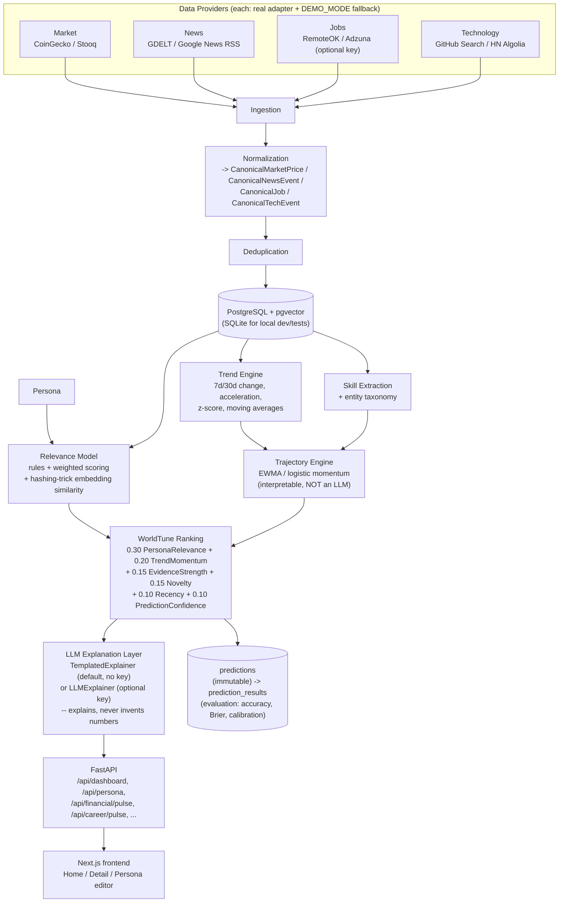

# WorldTune

**WorldTune doesn't show you the world. It shows you the part of the world that matters to you.**

WorldTune is a personalization, ranking and forecasting layer that sits conceptually on top of
WorldPulse's global signal collection. Where WorldPulse answers "what is happening in the
world," WorldTune answers:

> What is happening that matters to *me*, why does it matter, what is heating up or cooling
> down, and where might it be heading?

It is a separate product living in this repo (`worldtune/`), sharing no code with
`src/worldpulse/` — its own FastAPI backend, its own Next.js frontend, its own Postgres
database, its own tests. See `worldtune/backend/` and `worldtune/frontend/` for the
implementation; this document is the product/architecture overview.

## The two verticals

The prototype deliberately focuses on two verticals end-to-end rather than building many
half-working ones:

1. **Financial Pulse** — crypto (BTC, ETH), AI/technology stocks, macro context, scored and
   explained against the user's watchlist and sector interests.
2. **Career & Technology Pulse** — job-market demand, skill trends (rising/falling), and
   technology signals, scored and explained against the user's role, skills, and target roles.

## The demo persona

A Senior Data Engineer, 10 years' experience, Bengaluru, India. Current skills: Python, Spark,
Kafka, SQL, GCP, BigQuery, Airflow, dbt. Target roles: Staff Data Engineer, Data Platform
Engineer, AI Data Engineer, ML Platform Engineer. Watchlist: BTC, ETH. Sectors: AI, technology,
crypto. Learning interests: AI engineering, LLM systems, data infrastructure, distributed
systems, agent infrastructure. The persona is a structured, editable object (`GET/PUT
/api/persona`, and a full editor page in the frontend) — the architecture supports other
personas, this is simply the one seeded for the demo.

## Architecture



## Features (what actually works today)

- Structured, editable persona (location, career, financial interests, learning preferences)
- Four provider types (market, news, jobs, technology), each with a real adapter using a real
  free/keyless endpoint, and a deterministic `Demo*` fallback so the app **always** boots fully
  populated with zero configuration
- Canonical models so the API and frontend never depend on a third-party schema
- Skill taxonomy + extraction (Data Engineering / AI-ML / Cloud categories) with 7d/30d change,
  z-scores, and role/location-aware demand
- Entity graph (`config/entity_graph.yaml`) for lightweight relevance boosting (e.g. NVIDIA ->
  AI -> semiconductors -> AI infrastructure)
- WorldTune score: the exact weighted formula from the spec, fully explainable — every score
  returns its six weighted components, their contributions, and (for career signals) the
  skill/role/location/seniority sub-scores, plus the evidence and reasoning behind it
- Trend engine (real time-series stats: pandas/numpy, not an LLM) and trajectory engine
  (interpretable EWMA/logistic momentum models — financial: bullish/neutral/bearish + probability
  + confidence + horizon; career: growing/stable/declining for 7/30/90-day horizons)
- Immutable prediction storage + an evaluation framework (direction accuracy, Brier score,
  calibration, MAE, ranking stability) — see "How predictions are evaluated" below
- LLM explanation layer that is genuinely optional: the default `TemplatedExplainer` needs no
  key and only ever restates numbers the analytics layer already computed; an `LLMExplainer`
  skeleton is available if a key is configured, and is instructed never to invent a metric
- A single aggregated `GET /api/dashboard` endpoint so the frontend doesn't fan out to 20 calls
  to render the home screen
- Next.js/TypeScript/Tailwind dark UI: Home (Financial Pulse, Career Pulse, Today's Tune),
  a Detail page per signal with the full score breakdown, evidence, trend chart and trajectory,
  and a Persona editor
- 273 backend tests (unit + fixture-driven provider contract tests + one true end-to-end test)

## Screenshots

*(placeholder — run the app locally per "Setup" below and capture the home screen, a detail
page, and the persona editor)*

## Setup

Zero-config path (DEMO_MODE is the default — no API key, no Postgres, needed to try it):

```bash
cd worldtune/backend
pip install -e ".[dev]"     # or: pip install --break-system-packages -e ".[dev]"
uvicorn app.main:app --port 8090 --reload
```

```bash
cd worldtune/frontend
npm install
echo "NEXT_PUBLIC_API_BASE_URL=http://localhost:8090" > .env.local
npm run dev
```

Open `http://localhost:3000`.

Docker (also zero-config by default):

```bash
docker compose up worldtune-api worldtune-web postgres
```
API on `:8100`, frontend on `:3000` (frontend is built to call `:8100` in the compose topology —
see `docker-compose.yml` for exactly how the two ports are wired).

## Environment variables

All optional. Every one of them, if unset, causes that specific provider or feature to fall
back cleanly (never a crash) — see `backend/.env.example` for the full annotated list:

| Variable | Effect if unset |
|---|---|
| `DEMO_MODE` (default `true`) | seeded deterministic data; set `false` to prefer live providers |
| `DATABASE_URL` (default `sqlite:///./worldtune.db`) | Postgres+pgvector used instead when set |
| `ADZUNA_APP_ID` / `ADZUNA_APP_KEY` | Adzuna jobs provider reports unavailable and is skipped |
| `GITHUB_TOKEN` | GitHub search adapter runs unauthenticated (lower rate limit) |
| `LLM_API_KEY` | explanations use the templated (non-LLM) explainer |

## Data sources

| Type | Free, no key | Free, needs registration | Demo fallback |
|---|---|---|---|
| Market | CoinGecko, Stooq | — | seeded OHLCV + momentum for BTC/ETH/QQQ/NVDA/MSFT/GOOGL/AMD |
| News | GDELT DOC 2.0, Google News RSS | — | seeded market/tech headlines |
| Jobs | RemoteOK | Adzuna | ~30-50 seeded Data/AI/Platform jobs across seniority/location |
| Technology | GitHub Search API, HN Algolia | — | seeded tech signals (Iceberg, LLM observability, agent frameworks, etc.) |

`GET /api/system/data-sources` reports each provider's live-vs-demo status at runtime. In the
sandbox this was built in, every one of these external domains was network-blocked, so live
reachability should be re-confirmed on a normally-networked machine; the provider parsing logic
itself is verified offline against hand-built fixtures matching each API's real response shape.

## ML approach

Three deliberately separate kinds of "intelligence," per the spec:

1. **Relevance model** — "how important is this to this user": rules + weighted scoring +
   a deterministic hashing-trick embedding similarity (no downloaded model, no network
   dependency — the same honest simplification WorldPulse uses).
2. **Trend engine** — "is this heating up or cooling down": real time-series statistics
   (7d/30d change, acceleration, moving averages, z-scores) computed with pandas/numpy.
   Explicitly not an LLM.
3. **Trajectory engine** — "where might this be heading": interpretable models only
   (EWMA/momentum + a logistic mapping to probability). Explicitly not an LLM as forecaster.

The LLM (when configured) is used **only** for the explanation layer — summarizing,
contextualizing, and narrating numbers that the three engines above already computed. It is
structurally prevented from inventing a metric: the prompt only ever contains already-computed
values, and the default path needs no LLM at all.

**WorldTune makes no profitability or career-outcome guarantee.** Every dashboard response
carries a verbatim disclaimer field, and the frontend surfaces it on every page:

> Research prototype. Directional accuracy and calibration are diagnostics only; WorldTune
> makes no profitability claim and this is not investment or career advice.

## How predictions are evaluated

Every prediction is stored immutably at creation time (entity, type, horizon, predicted
direction, predicted probability, model version) and only ever gains resolution fields later
(actual outcome, correct/incorrect) — the same immutable-then-resolved discipline WorldPulse
uses for its own predictions, enforced by tests. Financial predictions are scored on direction
accuracy, precision/recall/F1, Brier score, calibration, and ROC AUC where applicable; career
predictions on MAE, direction accuracy, trend correlation, and ranking stability. `GET
/api/predictions` (and the accuracy/evaluation endpoint) expose these numbers directly — see the
backend's own report for the current (small, demo-scale) sample's actual measured accuracy;
it is reported honestly rather than tuned to look better.

## Known limitations

- Embeddings are a hashing-trick bag-of-words vector, not a semantic model; the entity graph
  configuration carries the semantic relationships instead.
- Deduplication is exact-match-after-normalization; genuine paraphrases can survive as separate
  rows (upgrade path: MinHash/LSH).
- The in-process rate limiter is per-worker; running N API workers multiplies the effective
  limit by N.
- Sentiment analysis is a finance/tech lexicon — no negation, sarcasm, or aspect handling.
- Trajectory V1 is a hand-weighted interpretable model, not a fitted one; `fit_direction_model`
  exists and degrades to `None` rather than raising on single-class label data.
- The frontend's trend-history chart is derived from the two known change figures (24h/7d/30d),
  not a real stored time series — labeled as such in the UI rather than implied to be full
  history.
- No dedicated per-job detail API endpoint yet; the job detail page is assembled client-side
  from the cached dashboard payload.

## Roadmap

- Real embedding model (sentence-transformers or similar) behind the same `Relevance model`
  interface, swappable without touching the ranking formula
- MinHash/LSH cross-source deduplication
- A fitted (not hand-weighted) trajectory model once enough resolved predictions accumulate
- Persisted time-series for trend history (rather than change-figure-derived charts)
- Additional personas beyond the single demo persona, and multi-user support
- A per-job detail endpoint
- Additional verticals beyond Financial/Career Pulse (only after the two above are further
  hardened, per the "do not overbuild secondary features" principle this prototype follows)
