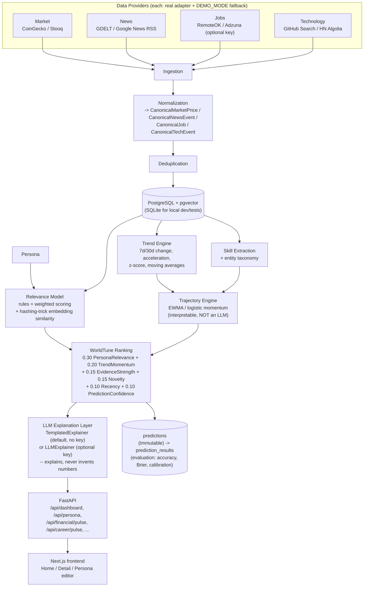

# WorldTune

**WorldTune doesn't show you the world. It shows you the part of the world that matters to you.**

WorldTune is a personalization, ranking and forecasting layer that sits conceptually on top of
WorldPulse's global signal collection. Where WorldPulse answers "what is happening in the
world," WorldTune answers:

> What is happening that matters to *me*, why does it matter, what is heating up or cooling
> down, and where might it be heading?

It is a separate product living in this repo (`worldtune/`), sharing no code with
`src/worldpulse/` — its own FastAPI backend, its own Next.js frontend, its own Postgres
database, its own tests. See `worldtune/backend/` and `worldtune/frontend/` for the
implementation; this document is the product/architecture overview.

## The two verticals

The prototype deliberately focuses on two verticals end-to-end rather than building many
half-working ones:

1. **Financial Pulse** — crypto (BTC, ETH), AI/technology stocks, macro context, scored and
   explained against the user's watchlist and sector interests.
2. **Career & Technology Pulse** — job-market demand, skill trends (rising/falling), and
   technology signals, scored and explained against the user's role, skills, and target roles.

## The demo persona

A Senior Data Engineer, 10 years' experience, Bengaluru, India. Current skills: Python, Spark,
Kafka, SQL, GCP, BigQuery, Airflow, dbt. Target roles: Staff Data Engineer, Data Platform
Engineer, AI Data Engineer, ML Platform Engineer. Watchlist: BTC, ETH. Sectors: AI, technology,
crypto. Learning interests: AI engineering, LLM systems, data infrastructure, distributed
systems, agent infrastructure. The persona is a structured, editable object (`GET/PUT
/api/persona`, and a full editor page in the frontend) — the architecture supports other
personas, this is simply the one seeded for the demo.

## Architecture



## World Shift detail pages

A World Shift detail page — six semantic tabs (Overview, Market/Tech Impact, Your Lens,
Relationships, What Happens Next, Evidence) rendered for two personas — is produced by one
shared pipeline. Full design: **[docs/WORLD_SHIFT_HLD.md](../docs/WORLD_SHIFT_HLD.md)** and
**[docs/WORLD_SHIFT_LLD.md](../docs/WORLD_SHIFT_LLD.md)**.

```
 GDELT GKG bulk → Silver → Gold metrics → signals → ranked shifts     (deterministic)
                                                  ↘ shift_intelligence.json
                                                            │
                        knowledge packs (declarative) ──────┤
                                                            ▼
                                            one composer, persona-aware
                                                            ▼
                                       one contract → one set of components
```

The split that makes this work: the **source artifact** holds everything time-bound and
observable (which publishers reported what, when attention moved, which entities recur) and
interprets nothing; a **knowledge pack** holds everything durable and interpretive (mechanisms,
actors, company exposures with reasoning chains, scenarios, section headings) and contains no
facts about the current news cycle. One composer joins them and applies the persona.

Adding a shift means adding one declarative module under
`backend/app/services/shift_knowledge/packs/` — no composer, schema or frontend change. A shift
with no pack still renders through a generic fallback that says openly that no dedicated
analysis exists yet, rather than showing an empty page.

Per shift, per persona this yields ~25 source records, 6 company exposures with reasoning
chains, 8–9 relationship nodes across upstream/downstream/cross-shift edges, 6 named actors and
3 scenarios — and **zero** claim titles shared between the two personas.

`armed-conflict-and-military-escalation` is served by a separate frozen editorial path and is
the quality reference the pipeline is measured against; a regression test asserts it still
serves its curated content unchanged.

## Features (what actually works today)

- Structured, editable persona (location, career, financial interests, learning preferences)
- Four provider types (market, news, jobs, technology), each with a real adapter using a real
  free/keyless endpoint, and a deterministic `Demo*` fallback so the app **always** boots fully
  populated with zero configuration
- Canonical models so the API and frontend never depend on a third-party schema
- Skill taxonomy + extraction (Data Engineering / AI-ML / Cloud categories) with 7d/30d change,
  z-scores, and role/location-aware demand
- Entity graph (`config/entity_graph.yaml`) for lightweight relevance boosting (e.g. NVIDIA ->
  AI -> semiconductors -> AI infrastructure)
- WorldTune score: the exact weighted formula from the spec, fully explainable — every score
  returns its six weighted components, their contributions, and (for career signals) the
  skill/role/location/seniority sub-scores, plus the evidence and reasoning behind it
- Trend engine (real time-series stats: pandas/numpy, not an LLM) and trajectory engine
  (interpretable EWMA/logistic momentum models — financial: bullish/neutral/bearish + probability
  + confidence + horizon; career: growing/stable/declining for 7/30/90-day horizons)
- Immutable prediction storage + an evaluation framework (direction accuracy, Brier score,
  calibration, MAE, ranking stability) — see "How predictions are evaluated" below
- LLM explanation layer that is genuinely optional: the default `TemplatedExplainer` needs no
  key and only ever restates numbers the analytics layer already computed; an `LLMExplainer`
  skeleton is available if a key is configured, and is instructed never to invent a metric
- A single aggregated `GET /api/dashboard` endpoint so the frontend doesn't fan out to 20 calls
  to render the home screen
- Next.js/TypeScript/Tailwind dark UI: Home (Financial Pulse, Career Pulse, Today's Tune),
  a Detail page per signal with the full score breakdown, evidence, trend chart and trajectory,
  and a Persona editor
- 322 backend tests (unit + fixture-driven provider contract tests + one true end-to-end test +
  20 World Shift quality-bar tests that assert depth, persona separation, heading correctness
  and evidence traceability for every shift x both personas)

## Screenshots

*(placeholder — run the app locally per "Setup" below and capture the home screen, a detail
page, and the persona editor)*

## Setup

Zero-config path (DEMO_MODE is the default — no API key, no Postgres, needed to try it):

```bash
cd worldtune/backend
pip install -e ".[dev]"     # or: pip install --break-system-packages -e ".[dev]"
uvicorn app.main:app --port 8090 --reload
```

```bash
cd worldtune/frontend
npm install
echo "NEXT_PUBLIC_API_BASE_URL=http://localhost:8090" > .env.local
npm run dev
```

Open `http://localhost:3000`.

Docker (also zero-config by default):

```bash
docker compose up worldtune-api worldtune-web postgres
```
API on `:8100`, frontend on `:3000` (frontend is built to call `:8100` in the compose topology —
see `docker-compose.yml` for exactly how the two ports are wired).

## Environment variables

All optional. Every one of them, if unset, causes that specific provider or feature to fall
back cleanly (never a crash) — see `backend/.env.example` for the full annotated list:

| Variable | Effect if unset |
|---|---|
| `DEMO_MODE` (default `true`) | seeded deterministic data; set `false` to prefer live providers |
| `DATABASE_URL` (default `sqlite:///./worldtune.db`) | Postgres+pgvector used instead when set |
| `ADZUNA_APP_ID` / `ADZUNA_APP_KEY` | Adzuna jobs provider reports unavailable and is skipped |
| `GITHUB_TOKEN` | GitHub search adapter runs unauthenticated (lower rate limit) |
| `LLM_API_KEY` | explanations use the templated (non-LLM) explainer |

## Data sources

| Type | Free, no key | Free, needs registration | Demo fallback |
|---|---|---|---|
| Market | CoinGecko, Stooq | — | seeded OHLCV + momentum for BTC/ETH/QQQ/NVDA/MSFT/GOOGL/AMD |
| News | GDELT DOC 2.0, Google News RSS | — | seeded market/tech headlines |
| Jobs | RemoteOK | Adzuna | ~30-50 seeded Data/AI/Platform jobs across seniority/location |
| Technology | GitHub Search API, HN Algolia | — | seeded tech signals (Iceberg, LLM observability, agent frameworks, etc.) |

`GET /api/system/data-sources` reports each provider's live-vs-demo status at runtime. In the
sandbox this was built in, every one of these external domains was network-blocked, so live
reachability should be re-confirmed on a normally-networked machine; the provider parsing logic
itself is verified offline against hand-built fixtures matching each API's real response shape.

## Data engineering

The World Shift pipeline runs a medallion layout over a bulk GDELT GKG extract. Every stage is
local, deterministic, idempotent and writes a `manifest.json` recording its input, row counts,
window, parameters and **explicit limitations**. No AI is involved at any point here.

| Stage | Script | Output |
|---|---|---|
| Bronze | `download_gdelt_year_sample.py`, `test_gdelt_bulk.py` | 35 GB raw `.gkg.csv.zip` → 1.6 GB parquet |
| Silver | `build_worldtune_layers.py` | `silver_articles.parquet` — 1,412,784 rows, deduped on `normalized_url`, six topic flags |
| Gold metrics | same | daily topic / entity / source metrics |
| Signals | `build_worldtune_signals.py` | z-scores, growth, persistence — **causal**: current day's completed aggregate plus prior rows only |
| Evidence | `build_worldtune_evidence.py` | scored candidates, weights `anomaly .40 / growth .25 / persistence .20 / diversity .15` |
| Ranking | `build_world_shifts.py` | `gold_world_shifts.parquet` — "is this topic moving?" |
| Briefing | `build_shift_intelligence.py` | `shift_intelligence.json` — "what is actually in the reporting?" |

The last stage is what made reference-grade pages possible. The ranking artifact keeps ten
source records selected alphabetically by domain, which reliably surfaced syndication mirrors
(`1037theloon.com`, `2news.com`). The briefing stage instead:

- selects records by **publisher standing** (wire services and named desks over content farms),
  one per domain, collapsing near-duplicate wire copy via a sorted word-shape key;
- **recovers headlines from publisher URLs**, because GKG titles are empty in this extract —
  `sk-hynix-weighs-intel-deal-to-produce-memory-chips-in-us` becomes *"SK Hynix weighs Intel
  deal to produce memory chips in US"*, and every record states the headline was recovered;
- **decodes entity rollups** out of provider offset encoding
  (`2#Iowa, United States#US#USIA##42.0046#…` → `Iowa, United States`);
- **maps theme codes to plain English and drops unmapped ones**, which is what guarantees no
  provider vocabulary can reach a reader;
- emits a 14-day attention series with per-day representative reports, so a dated timeline entry
  can say what was published rather than only how much was.

Runtime ~7 minutes over the full 1.41 M-row corpus. Offline, no network, no key.

## ML approach

Three deliberately separate kinds of "intelligence," per the spec:

1. **Relevance model** — "how important is this to this user": rules + weighted scoring +
   a deterministic hashing-trick embedding similarity (no downloaded model, no network
   dependency — the same honest simplification WorldPulse uses).
2. **Trend engine** — "is this heating up or cooling down": real time-series statistics
   (7d/30d change, acceleration, moving averages, z-scores) computed with pandas/numpy.
   Explicitly not an LLM.
3. **Trajectory engine** — "where might this be heading": interpretable models only
   (EWMA/momentum + a logistic mapping to probability). Explicitly not an LLM as forecaster.

The LLM (when configured) is used **only** for the explanation layer — summarizing,
contextualizing, and narrating numbers that the three engines above already computed. It is
structurally prevented from inventing a metric: the prompt only ever contains already-computed
values, and the default path needs no LLM at all.

**WorldTune makes no profitability or career-outcome guarantee.** Every dashboard response
carries a verbatim disclaimer field, and the frontend surfaces it on every page:

> Research prototype. Directional accuracy and calibration are diagnostics only; WorldTune
> makes no profitability claim and this is not investment or career advice.

### How AI is implemented in World Shift briefings

A fourth, separate use of AI exists for World Shift detail pages
(`backend/app/services/world_shift_ai.py`). It is an optional **interpretation** layer sitting
above the deterministic data engineering, not part of it — and it is currently **dormant**: no
LLM key is configured, `world_shift_snapshots` has zero rows, so there is **no AI in the request
path today**. Pages are served by the deterministic knowledge composer.

When enabled, a background refresh runs three schema-validated stages against
`google/gemini-2.5-flash` at `temperature=0.1`:

1. **Semantic extraction** — events, claims, entities and relationships; every object must cite
   `evidenceIds` from the supplied corpus.
2. **World-shift synthesis** — a persona-neutral briefing (context brief, timeline, actors,
   facts and figures, drivers, contradictions, three bounded scenarios).
3. **Persona synthesis, finance and tech** — both derived from the *same* semantic layer, which
   is the structural reason the two personas are different readings rather than rewrites.

Output is gated by two enforcement layers before anything is persisted. `validate_grounding()`
rejects invented evidence ids, invented URLs, ungrounded entity names, dangling relationship
endpoints, and **any numeral that does not appear in the corpus**. `filter_invalid_objects()`
drops individual bad leaf objects so one invalid item does not discard a good generation.

Five evidence classes are carried through to the UI: `observed`, `calculated`, `inferred`,
`associated` and `reasoned`. `reasoned` is an explicit, labelled inference connecting an
observed event to a plausible consequence using world knowledge — it is the only tier allowed to
name an entity absent from the corpus, because that is exactly what a company-exposure map is
for. It relaxes the causal-language and number-grounding checks and renders with a visibly
distinct treatment. The investment-advice and fabrication line never moves for any tier:

```python
HARD_FORBIDDEN = re.compile(r"\b(guarantee[sd]?|buy|sell|price target|"
    r"investment recommendation|should invest|will definitely|is going to)\b", re.I)
```

Publisher content is treated as untrusted data — the system prompt forbids following
instructions found inside articles, and schema validation is the actual enforcement. Generations
are cached on `sha256(canonical_json(input)) + stage + persona + model + prompt version`, so the
provenance of any published statement is reconstructable and a rerun over unchanged evidence is
free.

**What is not AI**, to be unambiguous: all medallion layers, signal scoring, shift ranking and
`shift_intelligence.json` are deterministic; the eight knowledge packs are hand-written by a
human, not generated; the composer is template joining. The pages currently served involve no
model call at all.

## How predictions are evaluated

Every prediction is stored immutably at creation time (entity, type, horizon, predicted
direction, predicted probability, model version) and only ever gains resolution fields later
(actual outcome, correct/incorrect) — the same immutable-then-resolved discipline WorldPulse
uses for its own predictions, enforced by tests. Financial predictions are scored on direction
accuracy, precision/recall/F1, Brier score, calibration, and ROC AUC where applicable; career
predictions on MAE, direction accuracy, trend correlation, and ranking stability. `GET
/api/predictions` (and the accuracy/evaluation endpoint) expose these numbers directly — see the
backend's own report for the current (small, demo-scale) sample's actual measured accuracy;
it is reported honestly rather than tuned to look better.

## Known limitations

- Embeddings are a hashing-trick bag-of-words vector, not a semantic model; the entity graph
  configuration carries the semantic relationships instead.
- Deduplication is exact-match-after-normalization; genuine paraphrases can survive as separate
  rows (upgrade path: MinHash/LSH).
- The in-process rate limiter is per-worker; running N API workers multiplies the effective
  limit by N.
- Sentiment analysis is a finance/tech lexicon — no negation, sarcasm, or aspect handling.
- Trajectory V1 is a hand-weighted interpretable model, not a fitted one; `fit_direction_model`
  exists and degrades to `None` rather than raising on single-class label data.
- The frontend's trend-history chart is derived from the two known change figures (24h/7d/30d),
  not a real stored time series — labeled as such in the UI rather than implied to be full
  history.
- No dedicated per-job detail API endpoint yet; the job detail page is assembled client-side
  from the cached dashboard payload.

World Shift pipeline specifically:

- The frozen reference shift (`armed-conflict-and-military-escalation`) still exposes provider
  terminology on its Relationships tab and in the tail of its evidence list. Pre-existing, and
  left alone because fixing it would change the reference's rendered content.
- Recovered headlines occasionally carry a detector false positive (a story about a ship
  incident matched Semiconductors on the word "Intel"). Each record states its headline was
  recovered from the URL; tightening the detector vocabulary is the real fix.
- Source titles are absent upstream — GKG metadata carries empty titles in this extract, so
  headlines are reconstructed rather than quoted.
- The three-stage AI path is unexercised end-to-end against live infrastructure; its validators
  are unit-tested but a full run needs an LLM key.
- Knowledge packs are hand-written. Eight exist; a ninth topic gets the generic fallback until
  someone writes one, which is precisely the gap the AI path is meant to close.

## Roadmap

- Real embedding model (sentence-transformers or similar) behind the same `Relevance model`
  interface, swappable without touching the ranking formula
- MinHash/LSH cross-source deduplication
- A fitted (not hand-weighted) trajectory model once enough resolved predictions accumulate
- Persisted time-series for trend history (rather than change-figure-derived charts)
- Enable the three-stage World Shift AI path so topics without a hand-written knowledge pack
  reach the same depth automatically
- Additional personas beyond the single demo persona, and multi-user support
- A per-job detail endpoint
- Additional verticals beyond Financial/Career Pulse (only after the two above are further
  hardened, per the "do not overbuild secondary features" principle this prototype follows)
